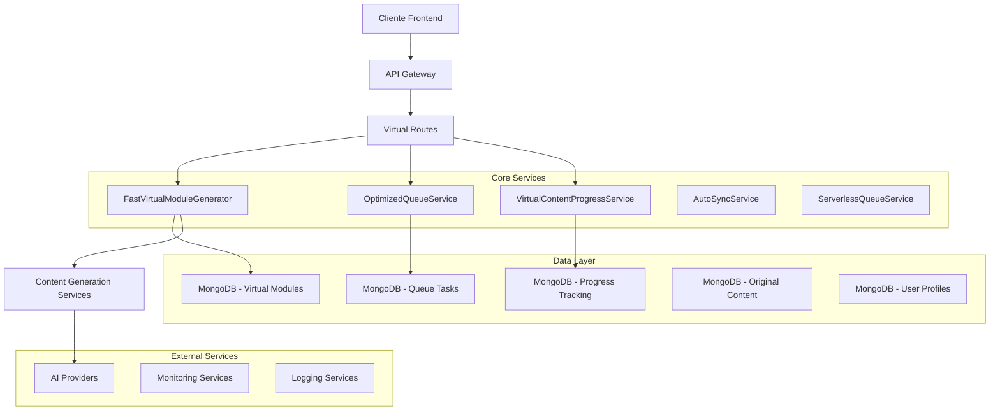
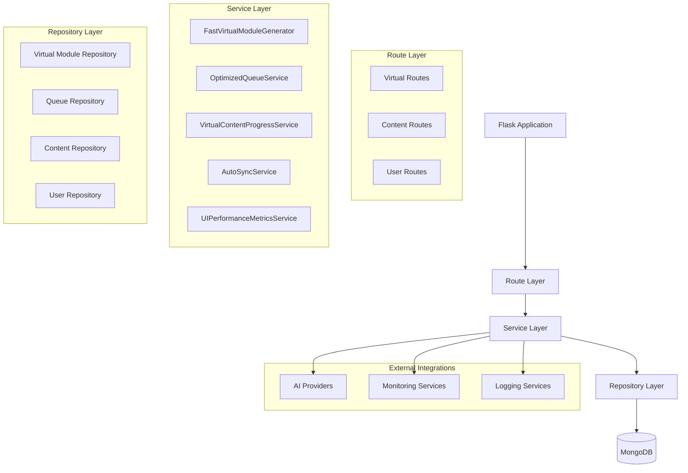
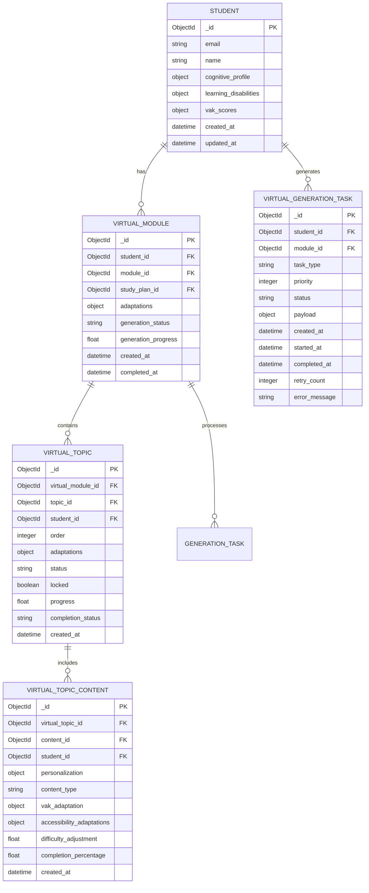

# Arquitectura Técnica del Sistema de Virtualización SapiensAI

## 1. Arquitectura General



## 2. Descripción de Tecnologías

- **Backend**: Python Flask + MongoDB
- **Queue System**: Custom ServerlessQueueService
- **AI Integration**: Multiple providers (OpenAI, Anthropic, Local)
- **Database**: MongoDB con índices optimizados
- **Monitoring**: Custom UIPerformanceMetricsService
- **Architecture**: Serverless-optimized with 45s timeout limits

## 3. Definiciones de Rutas

| Ruta | Propósito |
|------|----------|
| `/api/virtual/progressive-generation` | Inicialización de generación progresiva |
| `/api/virtual/process-queue` | Procesamiento de cola de tareas |
| `/api/virtual/trigger-next-generation` | Trigger automático al 80% de progreso |
| `/api/virtual/trigger-next-topic` | Trigger de siguiente tema |
| `/api/virtual/student/<id>/modules` | Consulta de módulos virtuales |
| `/api/virtual/module/<id>/queue/status` | Estado de cola del módulo |
| `/api/virtual/sync/<id>` | Sincronización manual |
| `/api/virtual/content/<id>/complete` | Marcar contenido completado |

## 4. Definiciones de API

### 4.1 API de Generación Progresiva

**Inicializar Generación Progresiva**
```
POST /api/virtual/progressive-generation
```

**Request:**
| Parámetro | Tipo | Requerido | Descripción |
|-----------|------|-----------|-------------|
| student_id | string | true | ID del estudiante |
| plan_id | string | true | ID del plan de estudios |
| class_id | string | false | ID de la clase |

**Response:**
| Parámetro | Tipo | Descripción |
|-----------|------|-------------|
| success | boolean | Estado de la operación |
| message | string | Mensaje descriptivo |
| data | object | Datos de respuesta |
| data.queued_modules | array | Módulos encolados |
| data.generated_modules | array | Módulos ya generados |

**Ejemplo Request:**
```json
{
  "student_id": "507f1f77bcf86cd799439011",
  "plan_id": "507f1f77bcf86cd799439012",
  "class_id": "507f1f77bcf86cd799439013"
}
```

**Ejemplo Response:**
```json
{
  "success": true,
  "message": "Generación progresiva iniciada",
  "data": {
    "queued_modules": [
      {
        "module_id": "507f1f77bcf86cd799439014",
        "task_id": "507f1f77bcf86cd799439015",
        "priority": 1,
        "status": "pending"
      }
    ],
    "generated_modules": [
      {
        "virtual_module_id": "507f1f77bcf86cd799439016",
        "module_id": "507f1f77bcf86cd799439017",
        "status": "completed"
      }
    ]
  }
}
```

### 4.2 API de Procesamiento de Cola

**Procesar Cola**
```
POST /api/virtual/process-queue
```

**Request:**
| Parámetro | Tipo | Requerido | Descripción |
|-----------|------|-----------|-------------|
| max_tasks | integer | false | Máximo de tareas a procesar (default: 1) |
| priority_filter | integer | false | Filtro por prioridad |

**Response:**
| Parámetro | Tipo | Descripción |
|-----------|------|-------------|
| success | boolean | Estado de la operación |
| processed_tasks | integer | Número de tareas procesadas |
| results | array | Resultados de cada tarea |

### 4.3 API de Triggers Automáticos

**Trigger de Siguiente Generación**
```
POST /api/virtual/trigger-next-generation
```

**Request:**
| Parámetro | Tipo | Requerido | Descripción |
|-----------|------|-----------|-------------|
| current_module_id | string | true | ID del módulo actual |
| student_id | string | true | ID del estudiante |
| progress | float | true | Progreso actual (0-100) |

**Response:**
| Parámetro | Tipo | Descripción |
|-----------|------|-------------|
| success | boolean | Estado de la operación |
| triggered | boolean | Si se activó la generación |
| next_module_id | string | ID del siguiente módulo |
| task_id | string | ID de la tarea encolada |

## 5. Arquitectura del Servidor



## 6. Modelo de Datos

### 6.1 Diagrama de Entidades



### 6.2 Definiciones DDL

**Tabla de Módulos Virtuales (virtual_modules)**
```javascript
// Crear colección
db.createCollection("virtual_modules")

// Crear índices
db.virtual_modules.createIndex({ "student_id": 1, "module_id": 1 }, { unique: true })
db.virtual_modules.createIndex({ "student_id": 1, "generation_status": 1 })
db.virtual_modules.createIndex({ "created_at": -1 })
db.virtual_modules.createIndex({ "study_plan_id": 1, "student_id": 1 })

// Datos de ejemplo
db.virtual_modules.insertOne({
  "_id": ObjectId(),
  "student_id": ObjectId("507f1f77bcf86cd799439011"),
  "module_id": ObjectId("507f1f77bcf86cd799439012"),
  "study_plan_id": ObjectId("507f1f77bcf86cd799439013"),
  "adaptations": {
    "cognitive_profile": {
      "vak_scores": {
        "visual": 0.8,
        "auditory": 0.3,
        "kinesthetic": 0.6,
        "reading_writing": 0.7
      },
      "learning_disabilities": {
        "dyslexia": false,
        "adhd": true,
        "visual_impairment": false
      },
      "cognitive_difficulties": ["memoria", "atención"],
      "cognitive_strengths": ["visual", "lógico"]
    },
    "generation_method": "fast",
    "generated_at": new Date()
  },
  "generation_status": "completed",
  "generation_progress": 100,
  "created_at": new Date(),
  "completed_at": new Date()
})
```

**Tabla de Temas Virtuales (virtual_topics)**
```javascript
// Crear colección
db.createCollection("virtual_topics")

// Crear índices
db.virtual_topics.createIndex({ "virtual_module_id": 1, "order": 1 })
db.virtual_topics.createIndex({ "student_id": 1, "status": 1 })
db.virtual_topics.createIndex({ "topic_id": 1, "student_id": 1 }, { unique: true })
db.virtual_topics.createIndex({ "locked": 1, "student_id": 1 })

// Datos de ejemplo
db.virtual_topics.insertOne({
  "_id": ObjectId(),
  "virtual_module_id": ObjectId("507f1f77bcf86cd799439014"),
  "topic_id": ObjectId("507f1f77bcf86cd799439015"),
  "student_id": ObjectId("507f1f77bcf86cd799439011"),
  "order": 1,
  "adaptations": {
    "cognitive_profile": {
      "vak_scores": {
        "visual": 0.8,
        "auditory": 0.3,
        "kinesthetic": 0.6
      }
    },
    "difficulty_adjustment": -0.2
  },
  "status": "active",
  "locked": false,
  "progress": 0.0,
  "completion_status": "not_started",
  "created_at": new Date()
})
```

**Tabla de Contenido Virtual (virtual_topic_contents)**
```javascript
// Crear colección
db.createCollection("virtual_topic_contents")

// Crear índices
db.virtual_topic_contents.createIndex({ "virtual_topic_id": 1 })
db.virtual_topic_contents.createIndex({ "student_id": 1, "completion_percentage": 1 })
db.virtual_topic_contents.createIndex({ "content_type": 1, "student_id": 1 })
db.virtual_topic_contents.createIndex({ "created_at": -1 })

// Datos de ejemplo
db.virtual_topic_contents.insertOne({
  "_id": ObjectId(),
  "virtual_topic_id": ObjectId("507f1f77bcf86cd799439016"),
  "content_id": ObjectId("507f1f77bcf86cd799439017"),
  "student_id": ObjectId("507f1f77bcf86cd799439011"),
  "personalization": {
    "adapted_for_profile": true,
    "sync_generated": true,
    "content_type": "video",
    "vak_adaptation": {
      "visual_emphasis": true,
      "audio_support": false,
      "interactive_elements": true,
      "text_optimization": true
    },
    "accessibility_adaptations": {
      "dyslexia_friendly": false,
      "adhd_optimized": true,
      "high_contrast": false
    },
    "difficulty_adjustment": -0.2
  },
  "content_type": "video",
  "completion_percentage": 0.0,
  "created_at": new Date()
})
```

**Tabla de Tareas de Generación (virtual_generation_tasks)**
```javascript
// Crear colección
db.createCollection("virtual_generation_tasks")

// Crear índices
db.virtual_generation_tasks.createIndex({ "status": 1, "priority": 1, "created_at": 1 })
db.virtual_generation_tasks.createIndex({ "student_id": 1, "status": 1 })
db.virtual_generation_tasks.createIndex({ "module_id": 1, "task_type": 1 })
db.virtual_generation_tasks.createIndex({ "created_at": -1 })

// Datos de ejemplo
db.virtual_generation_tasks.insertOne({
  "_id": ObjectId(),
  "student_id": ObjectId("507f1f77bcf86cd799439011"),
  "module_id": ObjectId("507f1f77bcf86cd799439012"),
  "task_type": "generate",
  "priority": 1,
  "status": "pending",
  "payload": {
    "plan_id": "507f1f77bcf86cd799439013",
    "class_id": "507f1f77bcf86cd799439018",
    "batch_initialization": true,
    "trigger_reason": "manual_request"
  },
  "created_at": new Date(),
  "retry_count": 0
})
```

## 7. Configuraciones de Optimización

### 7.1 Configuración de Timeouts
```python
# Configuraciones para arquitectura serverless
CONFIG = {
    "GENERATION_TIMEOUT": 45,  # segundos
    "INITIAL_BATCH_SIZE": 2,   # temas por módulo
    "MAX_CONCURRENT_TASKS": 3, # por estudiante
    "QUEUE_PROCESSING_LIMIT": 10, # tareas por ejecución
    "RETRY_ATTEMPTS": 3,
    "PROGRESS_TRIGGER_THRESHOLD": 80  # porcentaje
}
```

### 7.2 Configuración de Base de Datos
```python
# Configuración de MongoDB
MONGO_CONFIG = {
    "connection_timeout": 5000,
    "server_selection_timeout": 5000,
    "max_pool_size": 50,
    "min_pool_size": 5,
    "max_idle_time": 30000,
    "write_concern": {"w": 1, "j": True},
    "read_preference": "primary"
}
```

### 7.3 Configuración de Logging
```python
# Configuración de logging estructurado
LOGGING_CONFIG = {
    "version": 1,
    "formatters": {
        "structured": {
            "format": "%(asctime)s - %(name)s - %(levelname)s - %(message)s",
            "datefmt": "%Y-%m-%d %H:%M:%S"
        }
    },
    "handlers": {
        "console": {
            "class": "logging.StreamHandler",
            "formatter": "structured",
            "level": "INFO"
        },
        "file": {
            "class": "logging.FileHandler",
            "filename": "virtualization.log",
            "formatter": "structured",
            "level": "DEBUG"
        }
    },
    "loggers": {
        "virtualization": {
            "handlers": ["console", "file"],
            "level": "DEBUG",
            "propagate": False
        }
    }
}
```

Esta arquitectura técnica proporciona una base sólida para el sistema de virtualización, optimizada para entornos serverless y diseñada para escalabilidad y mantenibilidad.
