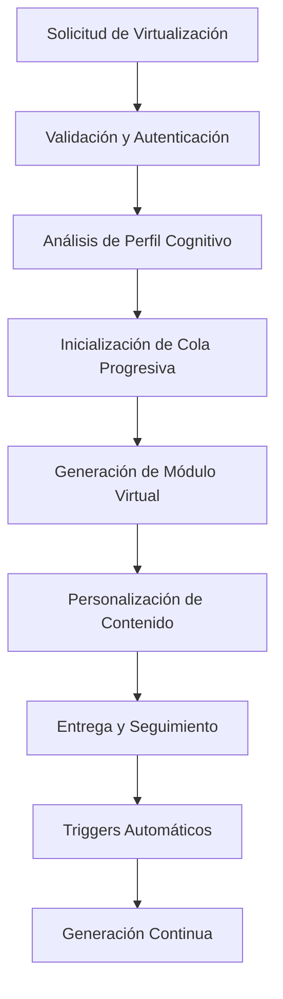

# Documentación Completa: Flujo de Virtualización en SapiensAI

## 1. Visión General del Sistema

El sistema de virtualización de SapiensAI transforma contenido educativo estático en experiencias de aprendizaje personalizadas y adaptativas. El flujo completo abarca desde la solicitud inicial hasta la entrega de contenido personalizado, pasando por sistemas de cola, personalización cognitiva y generación progresiva.

### Arquitectura Principal



## 2. Componentes Principales del Sistema

### 2.1 Servicios Core

- **FastVirtualModuleGenerator**: Generador optimizado para crear módulos virtuales
- **OptimizedQueueService**: Gestión inteligente de cola de generación
- **VirtualContentProgressService**: Seguimiento automático de progreso
- **ServerlessQueueService**: Cola adaptada para arquitectura serverless
- **AutoSyncService**: Sincronización automática de cambios

### 2.2 Modelos de Datos

- **VirtualModule**: Módulo personalizado por estudiante
- **VirtualTopic**: Tema adaptado con control de acceso
- **VirtualTopicContent**: Contenido personalizado específico
- **VirtualGenerationTask**: Tareas de generación en cola
- **ParallelContentGenerationTask**: Generación paralela avanzada

## 3. Flujo Detallado de Virtualización

### 3.1 Fase 1: Inicialización de Solicitud

#### Endpoint Principal
```
POST /api/virtual/progressive-generation
```

#### Parámetros Requeridos
- `student_id`: ID del estudiante
- `plan_id`: ID del plan de estudios
- `class_id`: ID de la clase (opcional)

#### Proceso de Validación

1. **Validación de Estudiante**
   ```python
   student = get_db().users.find_one({"_id": ObjectId(student_id)})
   if not student:
       return APIRoute.error(ErrorCodes.NOT_FOUND, "Estudiante no encontrado")
   ```

2. **Validación de Plan de Estudios**
   ```python
   study_plan = get_db().study_plans.find_one({"_id": ObjectId(plan_id)})
   if not study_plan:
       return APIRoute.error(ErrorCodes.NOT_FOUND, "Plan de estudios no encontrado")
   ```

3. **Identificación de Módulos Habilitados**
   - Solo módulos con temas publicados (`published: True`)
   - Filtrado de módulos ya generados
   - Ordenamiento por secuencia del plan

### 3.2 Fase 2: Análisis de Perfil Cognitivo

#### Extracción del Perfil
```python
student = get_db().users.find_one({"_id": ObjectId(student_id)})
cognitive_profile = student.get("cognitive_profile", {})
```

#### Componentes del Perfil Cognitivo

1. **Puntuaciones VAK (Visual, Auditivo, Kinestésico)**
   ```python
   vak_scores = {
       "visual": 0.8,
       "auditory": 0.3,
       "kinesthetic": 0.6,
       "reading_writing": 0.7
   }
   ```

2. **Dificultades de Aprendizaje**
   ```python
   learning_disabilities = {
       "dyslexia": False,
       "adhd": True,
       "visual_impairment": False
   }
   ```

3. **Fortalezas y Debilidades Cognitivas**
   ```python
   cognitive_profile = {
       "cognitive_difficulties": ["memoria", "atención"],
       "cognitive_strengths": ["visual", "lógico"]
   }
   ```

### 3.3 Fase 3: Gestión de Cola Progresiva

#### Sistema de Cola Inteligente

El `OptimizedQueueService` mantiene consistentemente **2 temas virtuales por delante** del progreso actual del estudiante.

#### Encolado de Tareas
```python
queue_service = ServerlessQueueService()
success, task_id = queue_service.enqueue_task(
    student_id=student_id,
    module_id=module_id,
    task_type="generate",
    priority=priority,
    payload={
        "plan_id": plan_id,
        "class_id": class_id,
        "batch_initialization": True
    }
)
```

#### Estados de Tareas
- `pending`: En espera de procesamiento
- `processing`: Siendo procesada actualmente
- `completed`: Completada exitosamente
- `failed`: Falló después de reintentos

### 3.4 Fase 4: Generación de Módulo Virtual

#### FastVirtualModuleGenerator.generate_single_module()

```python
def generate_single_module(self, student_id: str, module_id: str, timeout: int = 45) -> Tuple[bool, str]:
    start_time = datetime.now()
    
    # 1. Verificar módulo existente
    existing = self.collection.find_one({
        "student_id": ObjectId(student_id),
        "module_id": ObjectId(module_id)
    })
    
    if existing:
        return True, str(existing["_id"])
    
    # 2. Obtener módulo original
    original_module = self.db.modules.find_one({"_id": ObjectId(module_id)})
    
    # 3. Crear módulo virtual básico
    virtual_module_data = {
        "study_plan_id": str(original_module["study_plan_id"]),
        "module_id": module_id,
        "student_id": student_id,
        "adaptations": {
            "cognitive_profile": cognitive_profile,
            "generation_method": "fast",
            "generated_at": datetime.now()
        },
        "generation_status": "generating",
        "generation_progress": 50
    }
    
    # 4. Generar temas virtuales
    self._generate_virtual_topics_fast(
        module_id, student_id, virtual_module_id,
        cognitive_profile, preferences=None
    )
    
    # 5. Marcar como completado
    self.collection.update_one(
        {"_id": ObjectId(virtual_module_id)},
        {
            "$set": {
                "generation_status": "completed",
                "generation_progress": 100,
                "completed_at": datetime.now()
            }
        }
    )
```

### 3.5 Fase 5: Generación de Temas Virtuales

#### Lote Inicial Optimizado

El sistema genera inicialmente **2 temas** por módulo para optimizar tiempo de respuesta:

```python
def _generate_virtual_topics_fast(self, module_id: str, student_id: str,
                                 virtual_module_id: str, cognitive_profile: Dict,
                                 preferences: Dict = None, initial_batch_size: int = 2):
    # Obtener temas publicados ordenados
    topics = list(self.db.topics.find({
        "module_id": ObjectId(module_id),
        "published": True
    }).sort("created_at", 1))
    
    # Limitar al lote inicial
    topics_to_generate = topics[:initial_batch_size]
    
    for idx, topic in enumerate(topics_to_generate):
        # Crear tema virtual
        virtual_topic_data = {
            "topic_id": topic_id,
            "student_id": student_id,
            "virtual_module_id": virtual_module_id,
            "order": topic_order,
            "adaptations": {
                "cognitive_profile": cognitive_profile,
                "difficulty_adjustment": self._calculate_quick_difficulty_adjustment(
                    topic, cognitive_profile
                )
            },
            "status": "active",
            "locked": False,  # Lote inicial desbloqueado
            "progress": 0.0,
            "completion_status": "not_started"
        }
        
        # Generar contenido personalizado
        self._generate_topic_contents_for_sync(
            topic_id=topic_id,
            virtual_topic_id=virtual_topic_id,
            cognitive_profile=cognitive_profile,
            student_id=student_id,
            preferences=preferences
        )
```

### 3.6 Fase 6: Personalización de Contenido

#### Algoritmo de Selección Personalizada

El sistema aplica múltiples filtros para personalizar el contenido:

#### 6.1 Filtro VAK (Visual, Auditivo, Kinestésico)

```python
def _select_by_vak_preference(self, contents: List[Dict], cognitive_profile: Dict) -> List[Dict]:
    vak_scores = cognitive_profile.get("vak_scores", {})
    
    content_scores = []
    for content in contents:
        content_type = content.get("content_type", "")
        score = 0
        
        # Puntuación por tipo de contenido
        if content_type in ["video", "image", "infographic"]:
            score += vak_scores.get("visual", 0) * 2
        elif content_type in ["audio", "podcast"]:
            score += vak_scores.get("auditory", 0) * 2
        elif content_type in ["simulation", "interactive"]:
            score += vak_scores.get("kinesthetic", 0) * 2
        elif content_type in ["text", "document"]:
            score += vak_scores.get("reading_writing", 0) * 2
        
        content_scores.append((content, score))
    
    # Ordenar por puntuación y seleccionar los mejores
    content_scores.sort(key=lambda x: x[1], reverse=True)
    return [content for content, score in content_scores[:5]]  # Top 5
```

#### 6.2 Ajuste de Dificultad

```python
def _calculate_difficulty_adjustment(self, cognitive_profile: Dict) -> float:
    difficulties = cognitive_profile.get("cognitive_difficulties", [])
    strengths = cognitive_profile.get("cognitive_strengths", [])
    
    adjustment = 0.0
    
    # Reducir dificultad por dificultades
    for difficulty in difficulties:
        if difficulty in ["memoria", "atención", "procesamiento"]:
            adjustment -= 0.2
    
    # Aumentar dificultad por fortalezas
    for strength in strengths:
        if strength in ["lógico", "analítico", "creativo"]:
            adjustment += 0.1
    
    return max(-0.5, min(0.5, adjustment))  # Limitar entre -0.5 y 0.5
```

#### 6.3 Adaptaciones de Accesibilidad

```python
def _generate_content_personalization(self, content: Dict, cognitive_profile: Dict) -> Dict:
    learning_disabilities = cognitive_profile.get("learning_disabilities", {})
    vak_scores = cognitive_profile.get("vak_scores", {})
    
    return {
        "adapted_for_profile": True,
        "sync_generated": True,
        "content_type": content.get("content_type"),
        "vak_adaptation": {
            "visual_emphasis": vak_scores.get("visual", 0) > 0.6,
            "audio_support": vak_scores.get("auditory", 0) > 0.6,
            "interactive_elements": vak_scores.get("kinesthetic", 0) > 0.6,
            "text_optimization": vak_scores.get("reading_writing", 0) > 0.6
        },
        "accessibility_adaptations": {
            "dyslexia_friendly": learning_disabilities.get("dyslexia", False),
            "adhd_optimized": learning_disabilities.get("adhd", False),
            "high_contrast": learning_disabilities.get("visual_impairment", False)
        },
        "difficulty_adjustment": self._calculate_difficulty_adjustment(cognitive_profile)
    }
```

### 3.7 Fase 7: Sistema de Triggers Automáticos

#### Trigger al 80% de Progreso

Cuando un estudiante completa el 80% de un tema, se activa automáticamente la generación del siguiente:

```python
@virtual_bp.route('/trigger-next-generation', methods=['POST'])
def trigger_next_generation():
    data = request.get_json()
    current_module_id = data.get('current_module_id')
    student_id = data.get('student_id')
    progress = data.get('progress')
    
    if progress >= 80:
        # Buscar siguiente módulo
        next_module = find_next_module_in_sequence(current_module_id, student_id)
        
        if next_module and not module_already_generated(next_module, student_id):
            # Encolar generación automática
            queue_service.enqueue_task(
                student_id=student_id,
                module_id=str(next_module["_id"]),
                task_type="generate",
                priority=1,
                payload={
                    "trigger_reason": "auto_progress_80",
                    "source_module": current_module_id
                }
            )
```

#### Trigger de Siguiente Tema

```python
@virtual_bp.route('/content/<virtual_content_id>/trigger-next', methods=['POST'])
def trigger_next_topic_generation(virtual_content_id):
    # Verificar progreso del contenido actual
    virtual_content = get_db().virtual_topic_contents.find_one({
        "_id": ObjectId(virtual_content_id)
    })
    
    if virtual_content["completion_percentage"] >= 80:
        # Activar OptimizedQueueService para mantener 2 temas adelante
        queue_service = OptimizedQueueService()
        queue_service.maintain_topic_queue(
            virtual_module_id=virtual_content["virtual_topic_id"],
            student_id=virtual_content["student_id"]
        )
```

### 3.8 Fase 8: Procesamiento de Cola

#### Endpoint de Procesamiento
```
POST /api/virtual/process-queue
```

#### Lógica de Procesamiento

```python
@virtual_bp.route('/process-queue', methods=['POST'])
def process_queue():
    queue_service = ServerlessQueueService()
    fast_generator = FastVirtualModuleGenerator()
    
    # Obtener siguiente tarea pendiente
    task = queue_service.get_next_task()
    
    if task:
        try:
            # Marcar como procesando
            queue_service.mark_processing(task["_id"])
            
            # Procesar según tipo de tarea
            if task["task_type"] == "generate":
                success, result = fast_generator.generate_single_module(
                    student_id=task["student_id"],
                    module_id=task["module_id"],
                    timeout=40
                )
                
                if success:
                    queue_service.complete_task(
                        task["_id"], 
                        {"virtual_module_id": result}
                    )
                else:
                    queue_service.fail_task(task["_id"], result)
                    
        except Exception as e:
            queue_service.fail_task(task["_id"], str(e))
```

## 4. Endpoints Principales del Sistema

### 4.1 Endpoints de Generación

| Endpoint | Método | Propósito |
|----------|--------|----------|
| `/progressive-generation` | POST | Inicializa generación progresiva |
| `/process-queue` | POST | Procesa tareas en cola |
| `/trigger-next-generation` | POST | Trigger automático al 80% |
| `/trigger-next-topic` | POST | Trigger de siguiente tema |

### 4.2 Endpoints de Consulta

| Endpoint | Método | Propósito |
|----------|--------|----------|
| `/student/<student_id>/modules` | GET | Módulos virtuales del estudiante |
| `/module/<module_id>/queue/status` | GET | Estado de cola del módulo |
| `/topic/<topic_id>/contents` | GET | Contenidos virtuales del tema |
| `/generation-status/<student_id>` | GET | Estado general de generación |

### 4.3 Endpoints de Gestión

| Endpoint | Método | Propósito |
|----------|--------|----------|
| `/sync/<virtual_module_id>` | POST | Sincronización manual |
| `/content/<content_id>/complete` | POST | Marcar contenido completado |
| `/module/<module_id>/reset` | POST | Reiniciar módulo virtual |

## 5. Optimizaciones para Arquitectura Serverless

### 5.1 Límites de Tiempo

- **Timeout por módulo**: 45 segundos máximo
- **Lote inicial**: Solo 2 temas por módulo
- **Generación progresiva**: Temas adicionales bajo demanda

### 5.2 Estrategias de Optimización

1. **Generación Lazy**: Solo genera contenido cuando se necesita
2. **Cache de Perfiles**: Reutiliza análisis de perfil cognitivo
3. **Batch Processing**: Agrupa operaciones de base de datos
4. **Fallback Systems**: Sistemas de respaldo para fallos

### 5.3 Manejo de Errores

```python
try:
    # Generación principal
    result = fast_generator.generate_single_module(...)
except TimeoutError:
    # Fallback a generación mínima
    result = generate_minimal_module(...)
except Exception as e:
    # Log y reintento
    logging.error(f"Error en generación: {str(e)}")
    queue_service.retry_task(task_id)
```

## 6. Monitoreo y Métricas

### 6.1 Métricas de Rendimiento

- Tiempo promedio de generación por módulo
- Tasa de éxito de generación
- Tiempo de respuesta de endpoints
- Utilización de cola

### 6.2 Métricas de Personalización

- Efectividad de adaptaciones VAK
- Impacto de ajustes de dificultad
- Uso de adaptaciones de accesibilidad
- Satisfacción del estudiante

### 6.3 Alertas y Logging

```python
# Logging estructurado
logging.info(f"Módulo virtual generado en {elapsed:.2f} segundos")
logging.warning(f"Generación lenta detectada: {module_id}")
logging.error(f"Fallo en personalización: {error_details}")

# Métricas de UI
ui_metrics_service = UIPerformanceMetricsService()
ui_metrics_service.record_ui_metrics(student_id, session_data)
```

## 7. Casos de Uso Avanzados

### 7.1 Sincronización Automática

Cuando el contenido original cambia, el sistema detecta y sincroniza automáticamente:

```python
class AutoSyncService:
    def detect_content_changes(self, module_id: str):
        # Detectar cambios en contenido original
        changes = self.change_detector.detect_changes(module_id)
        
        if changes:
            # Sincronizar módulos virtuales afectados
            affected_modules = self.find_affected_virtual_modules(module_id)
            
            for vm in affected_modules:
                self.fast_generator.synchronize_module_content(vm["_id"])
```

### 7.2 Generación Paralela (Fase 2B)

Para contenido complejo, el sistema soporta generación paralela:

```python
class ParallelContentGenerationTask:
    def __init__(self, student_id: str, virtual_topic_id: str, content_type: str):
        self.providers = ["openai", "anthropic", "local_model"]
        self.load_balancer = AIProviderLoadBalancer()
        
    def generate_with_fallback(self):
        for provider in self.providers:
            try:
                return self.generate_content(provider)
            except Exception:
                continue
        
        raise Exception("Todos los proveedores fallaron")
```

## 8. Consideraciones de Escalabilidad

### 8.1 Distribución de Carga

- **Queue Sharding**: Distribución de tareas por región/estudiante
- **Content Caching**: Cache distribuido para contenido frecuente
- **Database Indexing**: Índices optimizados para consultas frecuentes

### 8.2 Límites y Throttling

```python
# Límites por estudiante
MAX_CONCURRENT_GENERATIONS = 3
MAX_DAILY_GENERATIONS = 50

# Throttling por IP
RATE_LIMIT = "100/hour"

# Priorización de tareas
PRIORITY_LEVELS = {
    "immediate": 1,
    "normal": 5,
    "background": 10
}
```

## 9. Conclusión

El sistema de virtualización de SapiensAI proporciona una experiencia de aprendizaje completamente personalizada mediante:

1. **Análisis profundo** del perfil cognitivo del estudiante
2. **Generación inteligente** de contenido adaptado
3. **Cola progresiva** que mantiene el flujo de aprendizaje
4. **Triggers automáticos** para generación continua
5. **Optimizaciones serverless** para escalabilidad
6. **Monitoreo continuo** para mejora constante

Este sistema representa una implementación avanzada de personalización educativa que se adapta dinámicamente a las necesidades individuales de cada estudiante, optimizando tanto el rendimiento técnico como la experiencia de aprendizaje.
