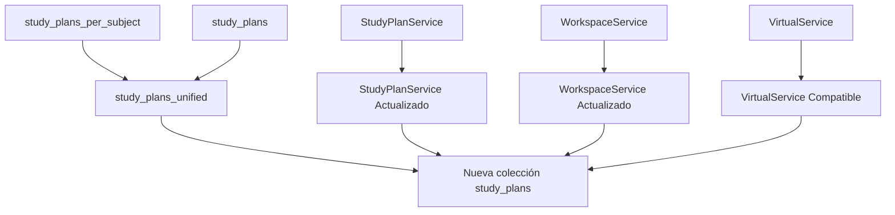

# Implementación Técnica: Unificación de Planes de Estudio

## 1. Arquitectura Técnica

### 1.1 Diagrama de Migración



### 1.2 Modelo de Datos Unificado

```typescript
interface UnifiedStudyPlan {
  _id: ObjectId;
  name: string;
  description: string;
  status: 'draft' | 'approved' | 'generating' | 'completed' | 'archived';
  created_at: Date;
  
  // Discriminador de tipo
  plan_type: 'institutional' | 'personal';
  
  // Campos institucionales (cuando plan_type = 'institutional')
  version?: string;
  author_id?: ObjectId;
  subject_id?: ObjectId;
  approval_date?: Date;
  
  // Campos personales (cuando plan_type = 'personal')
  user_id?: ObjectId;
  workspace_id?: ObjectId;
  objectives?: string[];
  pdf_content?: string;
  document_url?: string;
  progress?: number;
}
```

## 2. Plan de Implementación Detallado

### 2.1 Fase 1: Preparación (1-2 días)

#### Paso 1.1: Crear Modelo Unificado

```python
# src/study_plans/models.py
class UnifiedStudyPlan:
    def __init__(self,
                 name: str,
                 description: str,
                 plan_type: str,  # 'institutional' | 'personal'
                 status: str = "draft",
                 # Campos institucionales
                 version: Optional[str] = None,
                 author_id: Optional[str] = None,
                 subject_id: Optional[str] = None,
                 approval_date: Optional[datetime] = None,
                 # Campos personales
                 user_id: Optional[str] = None,
                 workspace_id: Optional[str] = None,
                 objectives: List[str] = None,
                 pdf_content: Optional[str] = None,
                 document_url: Optional[str] = None,
                 progress: int = 0):
        
        self.name = name
        self.description = description
        self.plan_type = plan_type
        self.status = status
        self.created_at = datetime.now()
        
        # Campos institucionales
        if plan_type == 'institutional':
            self.version = version
            self.author_id = ObjectId(author_id) if author_id else None
            self.subject_id = ObjectId(subject_id) if subject_id else None
            self.approval_date = approval_date
        
        # Campos personales
        elif plan_type == 'personal':
            self.user_id = ObjectId(user_id) if user_id else None
            self.workspace_id = ObjectId(workspace_id) if workspace_id else None
            self.objectives = objectives or []
            self.pdf_content = pdf_content
            self.document_url = document_url
            self.progress = progress
    
    def to_dict(self) -> dict:
        base_dict = {
            "name": self.name,
            "description": self.description,
            "plan_type": self.plan_type,
            "status": self.status,
            "created_at": self.created_at
        }
        
        if self.plan_type == 'institutional':
            base_dict.update({
                "version": self.version,
                "author_id": self.author_id,
                "subject_id": self.subject_id,
                "approval_date": self.approval_date
            })
        elif self.plan_type == 'personal':
            base_dict.update({
                "user_id": self.user_id,
                "workspace_id": self.workspace_id,
                "objectives": self.objectives,
                "pdf_content": self.pdf_content,
                "document_url": self.document_url,
                "progress": self.progress
            })
        
        return base_dict
```

#### Paso 1.2: Script de Migración

```python
# scripts/migrate_study_plans_unified.py
from pymongo import MongoClient
from bson import ObjectId
from datetime import datetime
import logging

def migrate_study_plans():
    """Migrar ambas colecciones a una estructura unificada"""
    
    client = MongoClient("mongodb://localhost:27017/")
    db = client.sapiens_db
    
    logging.info("Iniciando migración de planes de estudio...")
    
    # Crear colección temporal
    unified_collection = db.study_plans_unified
    
    # Migrar study_plans_per_subject (institucionales)
    institutional_count = 0
    for plan in db.study_plans_per_subject.find({}):
        unified_plan = {
            "_id": plan["_id"],
            "name": plan.get("name", "Plan sin título"),
            "description": plan.get("description", ""),
            "status": plan.get("status", "draft"),
            "plan_type": "institutional",
            "created_at": plan.get("created_at", datetime.utcnow()),
            
            # Campos institucionales
            "version": plan.get("version"),
            "author_id": plan.get("author_id"),
            "subject_id": plan.get("subject_id"),
            "approval_date": plan.get("approval_date")
        }
        
        unified_collection.insert_one(unified_plan)
        institutional_count += 1
    
    # Migrar study_plans (personales)
    personal_count = 0
    for plan in db.study_plans.find({}):
        unified_plan = {
            "_id": plan["_id"],
            "name": plan.get("title", plan.get("name", "Plan personal")),
            "description": plan.get("description", ""),
            "status": plan.get("status", "generating"),
            "plan_type": "personal",
            "created_at": plan.get("created_at", datetime.utcnow()),
            
            # Campos personales
            "user_id": plan.get("user_id"),
            "workspace_id": plan.get("workspace_id"),
            "objectives": plan.get("objectives", []),
            "pdf_content": plan.get("pdf_content"),
            "document_url": plan.get("document_url"),
            "progress": plan.get("progress", 0)
        }
        
        unified_collection.insert_one(unified_plan)
        personal_count += 1
    
    # Crear índices
    unified_collection.create_index([("plan_type", 1)])
    unified_collection.create_index([("user_id", 1), ("workspace_id", 1)])
    unified_collection.create_index([("subject_id", 1), ("status", 1)])
    unified_collection.create_index([("status", 1)])
    unified_collection.create_index([("created_at", -1)])
    
    logging.info(f"Migración completada:")
    logging.info(f"- Planes institucionales: {institutional_count}")
    logging.info(f"- Planes personales: {personal_count}")
    logging.info(f"- Total: {institutional_count + personal_count}")
    
    return unified_collection

def backup_original_collections():
    """Crear backup de colecciones originales"""
    client = MongoClient("mongodb://localhost:27017/")
    db = client.sapiens_db
    
    # Backup study_plans_per_subject
    db.study_plans_per_subject.aggregate([
        {"$out": "study_plans_per_subject_backup"}
    ])
    
    # Backup study_plans
    db.study_plans.aggregate([
        {"$out": "study_plans_backup"}
    ])
    
    logging.info("Backups creados exitosamente")

def switch_to_unified():
    """Cambiar a la colección unificada"""
    client = MongoClient("mongodb://localhost:27017/")
    db = client.sapiens_db
    
    # Renombrar colección actual de study_plans
    db.study_plans.rename("study_plans_old")
    
    # Renombrar colección unificada
    db.study_plans_unified.rename("study_plans")
    
    logging.info("Cambio a colección unificada completado")

if __name__ == "__main__":
    logging.basicConfig(level=logging.INFO)
    
    # Ejecutar migración
    backup_original_collections()
    migrate_study_plans()
    switch_to_unified()
```

### 2.2 Fase 2: Actualización de Servicios (2-3 días)

#### Paso 2.1: Actualizar StudyPlanService

```python
# src/study_plans/services.py
class StudyPlanService(VerificationBaseService):
    def __init__(self):
        super().__init__(collection_name="study_plans")
    
    def create_institutional_plan(self, plan_data: dict, workspace_info: Dict = None) -> str:
        """Crear plan de estudio institucional"""
        try:
            # Agregar tipo de plan
            plan_data["plan_type"] = "institutional"
            
            # Validar campos requeridos para planes institucionales
            required_fields = ["name", "author_id", "version"]
            for field in required_fields:
                if field not in plan_data:
                    raise AppException(f"Campo requerido faltante: {field}", AppException.BAD_REQUEST)
            
            # Crear plan usando modelo unificado
            unified_plan = UnifiedStudyPlan(
                name=plan_data["name"],
                description=plan_data.get("description", ""),
                plan_type="institutional",
                version=plan_data["version"],
                author_id=plan_data["author_id"],
                subject_id=plan_data.get("subject_id"),
                status=plan_data.get("status", "draft")
            )
            
            result = self.collection.insert_one(unified_plan.to_dict())
            return str(result.inserted_id)
            
        except Exception as e:
            logging.error(f"Error al crear plan institucional: {str(e)}")
            raise AppException(f"Error al crear plan de estudio: {str(e)}", AppException.INTERNAL_ERROR)
    
    def get_institutional_plans(self, subject_id: str = None, status: str = None) -> List[Dict]:
        """Obtener planes institucionales con filtros opcionales"""
        try:
            query = {"plan_type": "institutional"}
            
            if subject_id:
                query["subject_id"] = ObjectId(subject_id)
            if status:
                query["status"] = status
            
            plans = list(self.collection.find(query))
            
            # Convertir ObjectIds a strings
            for plan in plans:
                plan["_id"] = str(plan["_id"])
                if plan.get("author_id"):
                    plan["author_id"] = str(plan["author_id"])
                if plan.get("subject_id"):
                    plan["subject_id"] = str(plan["subject_id"])
            
            return plans
            
        except Exception as e:
            logging.error(f"Error al obtener planes institucionales: {str(e)}")
            return []
    
    def check_study_plan_exists(self, plan_id: str) -> bool:
        """Verificar existencia en colección unificada"""
        try:
            return self.collection.find_one({"_id": ObjectId(plan_id)}) is not None
        except Exception as e:
            logging.error(f"Error al verificar existencia del plan: {str(e)}")
            return False
    
    def get_study_plan(self, plan_id: str, workspace_info: Dict = None) -> Optional[Dict]:
        """Obtener plan de estudio (institucional o personal)"""
        try:
            plan = self.collection.find_one({"_id": ObjectId(plan_id)})
            if not plan:
                return None
            
            # Convertir ObjectIds a strings
            plan["_id"] = str(plan["_id"])
            
            if plan["plan_type"] == "institutional":
                if plan.get("author_id"):
                    plan["author_id"] = str(plan["author_id"])
                if plan.get("subject_id"):
                    plan["subject_id"] = str(plan["subject_id"])
            elif plan["plan_type"] == "personal":
                if plan.get("user_id"):
                    plan["user_id"] = str(plan["user_id"])
                if plan.get("workspace_id"):
                    plan["workspace_id"] = str(plan["workspace_id"])
            
            # Obtener módulos asociados (funcionalidad existente)
            modules = list(get_db().modules.find({"study_plan_id": ObjectId(plan_id)}))
            
            for module in modules:
                module["_id"] = str(module["_id"])
                module["study_plan_id"] = str(module["study_plan_id"])
                
                # Obtener temas del módulo
                topics = list(get_db().topics.find({"module_id": module["_id"]}))
                for topic in topics:
                    topic["_id"] = str(topic["_id"])
                    topic["module_id"] = str(topic["module_id"])
                
                module["topics"] = topics
                
                # Obtener evaluaciones del módulo
                evaluations = list(get_db().evaluations.find({"module_id": module["_id"]}))
                for evaluation in evaluations:
                    evaluation["_id"] = str(evaluation["_id"])
                    evaluation["module_id"] = str(evaluation["module_id"])
                
                module["evaluations"] = evaluations
            
            plan["modules"] = modules
            return plan
            
        except Exception as e:
            logging.error(f"Error al obtener plan de estudio: {str(e)}")
            return None
```

#### Paso 2.2: Actualizar WorkspaceService

```python
# src/workspaces/services.py
def create_personal_study_plan(self, workspace_id: str, user_id: str, description: str, 
                              objectives: List[str] = None, pdf_file = None) -> Tuple[bool, str, Dict[str, Any]]:
    """Crear plan de estudio personalizado para workspace individual"""
    try:
        # Validar que es un workspace INDIVIDUAL_STUDENT
        workspace = self.get_workspace_by_id(workspace_id, user_id)
        if workspace['workspace_type'] != 'INDIVIDUAL_STUDENT':
            raise AppException("Solo disponible para workspaces de estudiante individual", AppException.BAD_REQUEST)
        
        # Procesar archivo PDF si se proporciona
        pdf_content = None
        if pdf_file:
            pdf_content = self._process_pdf_file(pdf_file)
        
        # Crear plan usando modelo unificado
        unified_plan = UnifiedStudyPlan(
            name=f"Plan Personal - {workspace.get('name', 'Workspace')}",
            description=description,
            plan_type="personal",
            user_id=user_id,
            workspace_id=workspace_id,
            objectives=objectives or [],
            pdf_content=pdf_content,
            status="generating"
        )
        
        result = self.db.study_plans.insert_one(unified_plan.to_dict())
        study_plan_id = str(result.inserted_id)
        
        # Iniciar generación asíncrona
        self._trigger_study_plan_generation(study_plan_id, description, objectives)
        
        response_data = {
            "study_plan_id": study_plan_id,
            "status": "generating",
            "message": "Plan de estudio en generación"
        }
        
        return True, "Plan de estudio creado exitosamente", response_data
        
    except Exception as e:
        if isinstance(e, AppException):
            raise
        raise AppException(f"Error al crear plan de estudio: {str(e)}", AppException.INTERNAL_ERROR)

def get_personal_study_plans(self, workspace_id: str, user_id: str, workspace_type: str) -> Dict[str, Any]:
    """Obtener planes de estudio personales del workspace"""
    try:
        # Buscar planes personales del usuario en este workspace
        study_plans = list(self.db.study_plans.find({
            "plan_type": "personal",
            "user_id": ObjectId(user_id),
            "workspace_id": ObjectId(workspace_id)
        }))
        
        # Formatear respuesta
        formatted_plans = []
        for plan in study_plans:
            formatted_plans.append({
                "study_plan_id": str(plan["_id"]),
                "name": plan.get("name"),
                "description": plan.get("description"),
                "objectives": plan.get("objectives", []),
                "status": plan.get("status"),
                "progress": plan.get("progress", 0),
                "created_at": plan.get("created_at")
            })
        
        return {
            "study_plans": formatted_plans,
            "total_count": len(formatted_plans),
            "workspace_type": workspace_type
        }
        
    except Exception as e:
        raise AppException(f"Error al obtener planes de estudio: {str(e)}", AppException.INTERNAL_ERROR)
```

### 2.3 Fase 3: Validación y Testing (1-2 días)

#### Paso 3.1: Tests de Integración

```python
# tests/test_unified_study_plans.py
import pytest
from src.study_plans.services import StudyPlanService
from src.workspaces.services import WorkspaceService

class TestUnifiedStudyPlans:
    
    def test_create_institutional_plan(self):
        """Test creación de plan institucional"""
        service = StudyPlanService()
        
        plan_data = {
            "name": "Plan de Matemáticas",
            "description": "Plan para curso de matemáticas",
            "version": "1.0",
            "author_id": "507f1f77bcf86cd799439011",
            "subject_id": "507f1f77bcf86cd799439012"
        }
        
        plan_id = service.create_institutional_plan(plan_data)
        assert plan_id is not None
        
        # Verificar que se puede recuperar
        retrieved_plan = service.get_study_plan(plan_id)
        assert retrieved_plan["plan_type"] == "institutional"
        assert retrieved_plan["name"] == "Plan de Matemáticas"
    
    def test_create_personal_plan(self):
        """Test creación de plan personal"""
        workspace_service = WorkspaceService()
        
        success, message, data = workspace_service.create_personal_study_plan(
            workspace_id="507f1f77bcf86cd799439013",
            user_id="507f1f77bcf86cd799439014",
            description="Mi plan personal de estudio",
            objectives=["Aprender Python", "Dominar FastAPI"]
        )
        
        assert success is True
        assert "study_plan_id" in data
        
        # Verificar que se puede recuperar
        study_plan_service = StudyPlanService()
        retrieved_plan = study_plan_service.get_study_plan(data["study_plan_id"])
        assert retrieved_plan["plan_type"] == "personal"
        assert len(retrieved_plan["objectives"]) == 2
    
    def test_virtual_endpoint_compatibility(self):
        """Test que el endpoint virtual funciona con ambos tipos"""
        # Este test verificaría que /api/virtual/progressive-generation
        # funciona tanto con planes institucionales como personales
        pass
    
    def test_check_study_plan_exists_unified(self):
        """Test verificación de existencia en colección unificada"""
        service = StudyPlanService()
        
        # Crear plan de prueba
        plan_data = {
            "name": "Plan de Prueba",
            "description": "Plan para testing",
            "version": "1.0",
            "author_id": "507f1f77bcf86cd799439011"
        }
        
        plan_id = service.create_institutional_plan(plan_data)
        
        # Verificar existencia
        exists = service.check_study_plan_exists(plan_id)
        assert exists is True
        
        # Verificar no existencia
        fake_id = "507f1f77bcf86cd799439999"
        not_exists = service.check_study_plan_exists(fake_id)
        assert not_exists is False
```

## 3. Cronograma de Implementación

| Fase          | Duración | Actividades                                 | Responsable    |
| ------------- | -------- | ------------------------------------------- | -------------- |
| Preparación   | 1-2 días | Crear modelo unificado, script de migración | Backend Dev    |
| Migración     | 0.5 días | Ejecutar migración, crear backups           | DevOps/Backend |
| Actualización | 2-3 días | Modificar servicios, endpoints              | Backend Dev    |
| Testing       | 1-2 días | Tests unitarios e integración               | QA/Backend     |
| Validación    | 1 día    | Pruebas en staging, verificación            | Full Team      |
| Deploy        | 0.5 días | Deploy a producción, monitoreo              | DevOps         |

**Total estimado: 5-9 días**

## 4. Criterios de Éxito

1. ✅ El endpoint `/api/virtual/progressive-generation` funciona con planes de workspaces
2. ✅ Todos los tests existentes siguen pasando
3. ✅ No hay pérdida de datos durante la migración
4. ✅ Performance se mantiene o mejora
5. ✅ APIs mantienen compatibilidad hacia atrás

## 5. Plan de Rollback

En caso de problemas:

1. **Restaurar colecciones originales** desde backups
2. **Revertir cambios de código** usando git
3. **Verificar integridad** de datos restaurados
4. **Comunicar incidencia** al equipo

```bash
# Script de rollback
mongorestore --db sapiens_db --collection study_plans_per_subject study_plans_per_subject_backup
mongorestore --db sapiens_db --collection study_plans study_plans_backup
git revert <commit_hash>
```

